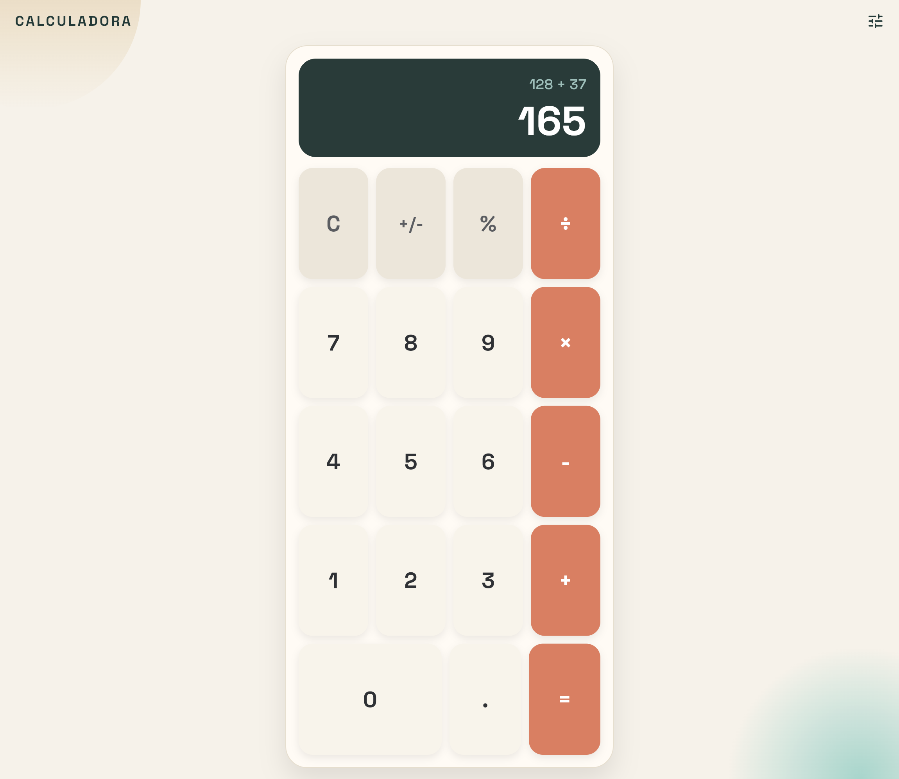
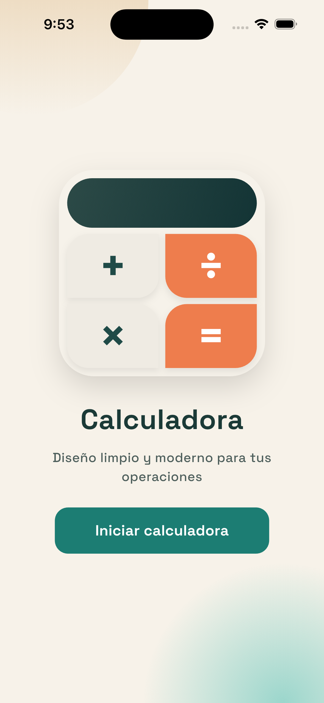

# Calculadora UI (Solo Diseno)

Este proyecto es un rediseño visual de una calculadora en Flutter.

Importante:
- Se trabajo solo la interfaz.
- No existe logica de calculo ni comportamiento de botones.
- El objetivo principal fue crear una pantalla moderna, limpia y con identidad visual.

## Vista Final



## Pantalla de Inicio



## Que se hizo

Se reemplazo la app base de contador por una pantalla de calculadora no funcional, incluyendo:

1. Jerarquia visual clara (encabezado, display, teclado).
2. Estilo de boton por categorias (operadores, teclas suaves, numeros).
3. Fondo con formas y gradientes para profundidad visual.
4. Tipografia personalizada para un look mas editorial.
5. Animacion de entrada suave para dar presencia inicial.
6. Composicion responsive centrada para escritorio y movil.

## Componentes Implementados

En el archivo principal se construyeron los siguientes widgets:

1. CalculatorDesignApp
- Configura MaterialApp, tema global y tipografia.

2. CalculatorDesignPage
- Pantalla principal.
- Estructura general con Stack, SafeArea y contenedor principal de calculadora.

3. _BackdropShapes
- Dibuja formas circulares con gradientes para ambientacion del fondo.

4. _DisplayPanel
- Panel superior de resultado.
- Muestra una operacion de ejemplo y el resultado en grande.

5. _KeyRow
- Construye una fila de teclas.
- Soporta tecla ancha inicial para la fila del cero.

6. _CalcKey
- Componente visual de tecla individual.
- Aplica estilos segun tipo de tecla (operador, funcion o numero).

## Linea Visual del Diseno

1. Tipografia
- Fuente principal: Space Grotesk (paquete google_fonts).
- Uso de pesos fuertes en titulo y teclas para mayor contraste.

2. Paleta de color
- Base calida y clara para fondo general.
- Display oscuro para contraste alto en numeros.
- Operadores en tono coral para foco de accion.
- Teclas suaves en tonos neutros para separar funciones secundarias.

3. Profundidad y volumen
- Bordes redondeados amplios.
- Sombras suaves para separar capas.
- Contenedor principal centrado con ancho maximo para mantener composicion limpia.

4. Movimiento
- Animacion de aparicion al cargar:
	- Fade in
	- Desplazamiento vertical leve

## Estructura de Pantalla

1. Encabezado
- Titulo CALCULADORA.
- Icono de ajustes en la parte superior derecha.

2. Cuerpo principal
- Tarjeta principal con bordes redondeados.
- Display arriba.
- Teclado de 5 filas abajo.

3. Teclado
- Fila funciones: C, +/-, %, division.
- Filas numericas: 7-9, 4-6, 1-3.
- Fila final: 0 (ancho doble), punto, igual.

## Alcance del Proyecto

Incluye:
- Diseno de interfaz completo.
- Tema visual y sistema basico de estilos.
- Componentizacion para mantener orden y escalabilidad.

No incluye:
- Logica de operaciones matematicas.
- Manejo de estado de calculadora.
- Interacciones funcionales en los botones.

## Dependencias usadas

- flutter
- google_fonts

## Como ejecutar

1. Instalar dependencias:

```bash
flutter pub get
```

2. Ejecutar la app:

```bash
flutter run
```

## Nota

Si deseas, el siguiente paso natural es mantener exactamente este diseno y conectar la logica de calculadora sin modificar la estetica.
